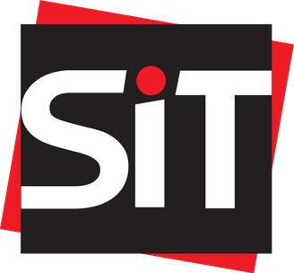

  

# 👋 Hi there! I'm Alexi

I'm a student at the Singapore Institute of Technology pursuing a BSc (Hons) in Applied Artificial Intelligence. I'm especially interested in artificial intelligence, deep learning, and building practical projects that turn ideas into something useful.

I also have a <a href="https://ink-termite-00a.notion.site/Alexi-s-Notes-14883ecdfdac80e2a6a6c55ad84df239" style="text-decoration: underline; text-decoration-style: dotted;"> notion blog</a> where I write down things I find and learn about. It's kinda WIP.

## More About Me

This profile is where I share projects and experiments that reflect both what I'm learning and what I want to keep exploring. I like to reimplement papers and combine them with my own methodology just out of curiousity.

I also co-lead my school's drone team, where I am in charge of perception and controls.

### Experience

- Currently at  A*STAR
- Previously at   SIT x NVIDIA AI Center,  Cynapse.ai

## Current Focus

- Inference Optimization (ONNX, Distillation, Pruning etc.)
- Computer Vision
- Autonomous Vehicles
